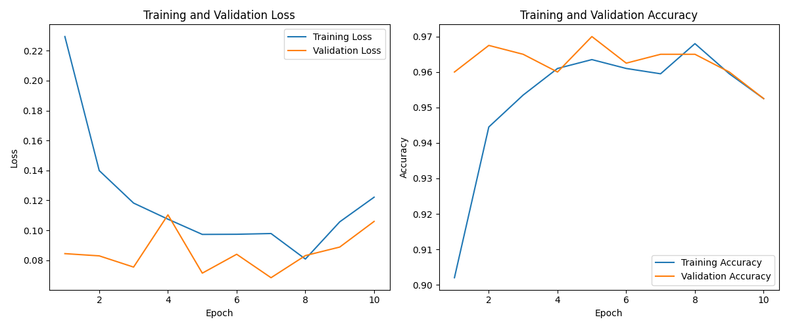
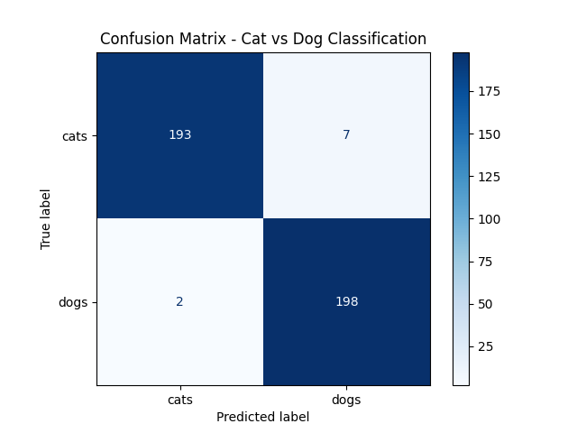
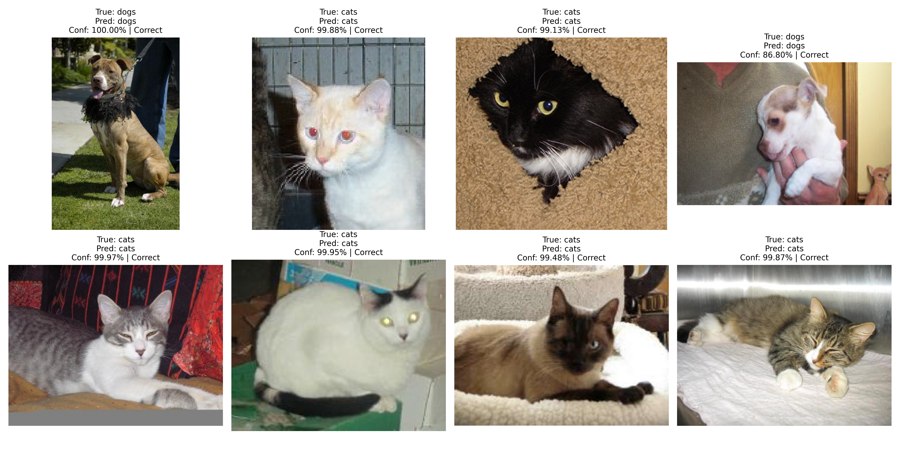

# Cat and Dog Image Classification Using Transfer Learning with ResNet18

Bu proje, deep learning dersi kapsamında geliştirilmiş bir görüntü sınıflandırma çalışmasıdır. Projede amaç, kedi ve köpek görüntülerini sınıflandırabilen bir derin öğrenme modeli geliştirmektir.

Model olarak, ImageNet veri seti üzerinde önceden eğitilmiş **ResNet18** mimarisi kullanılmıştır. Transfer learning yaklaşımı sayesinde model tamamen sıfırdan eğitilmemiş, önceden öğrenilmiş görsel özellikler kullanılarak kedi-köpek sınıflandırma problemine uyarlanmıştır.

---

## İçindekiler

- [Proje Amacı](#proje-amacı)
- [Problem Tanımı](#problem-tanımı)
- [Kullanılan Yöntem](#kullanılan-yöntem)
- [Transfer Learning Nedir?](#transfer-learning-nedir)
- [Kullanılan Model: ResNet18](#kullanılan-model-resnet18)
- [Veri Seti](#veri-seti)
- [Proje Klasör Yapısı](#proje-klasör-yapısı)
- [Kurulum](#kurulum)
- [Model Eğitimi](#model-eğitimi)
- [Model Değerlendirme](#model-değerlendirme)
- [Tahmin Yapma](#tahmin-yapma)
- [Sonuçlar](#sonuçlar)
- [Rapor İçin Özet](#rapor-için-özet)
- [Kullanılan Teknolojiler](#kullanılan-teknolojiler)
- [Gelecek Geliştirmeler](#gelecek-geliştirmeler)

---

## Proje Amacı

Bu projenin amacı, kedi ve köpek görüntülerini sınıflandırabilen bir deep learning modeli geliştirmektir.

Model, verilen bir görüntünün iki sınıftan hangisine ait olduğunu tahmin eder:

```text
Cat
Dog
```
Bu çalışma ile aşağıdaki deep learning adımları uygulanmıştır:

1. Veri setinin hazırlanması
2. Görüntülerin ön işlenmesi
3. Transfer learning yaklaşımının uygulanması
4. ResNet18 modelinin kedi-köpek sınıflandırması için uyarlanması
5. Modelin eğitilmesi
6. Model performansının değerlendirilmesi
7. Sonuçların grafikler ve metriklerle raporlanması 

---

## Problem Tanımı

Görüntü sınıflandırma, bilgisayarlı görü alanında temel problemlerden biridir. Bu projede problem, bir görüntünün kedi mi yoksa köpek mi olduğunu tahmin etmek olarak tanımlanmıştır.

Modelin girdisi bir hayvan görüntüsüdür. Modelin çıktısı ise bu görüntünün ait olduğu sınıftır.

Input  : Animal image
Output : Cat or Dog

Örnek:

Input  : dog_image.jpg
Output : Dog 

---

## Kullanılan Yöntem

Bu projede Transfer Learning yöntemi kullanılmıştır.

Tamamen sıfırdan bir CNN modeli eğitmek yerine, daha önce büyük bir veri seti üzerinde eğitilmiş olan ResNet18 modeli kullanılmıştır. Modelin son sınıflandırma katmanı değiştirilmiş ve çıktı sayısı 2 olacak şekilde yeniden düzenlenmiştir.

Orijinal ResNet18 modeli:

```bash 
Input Image
↓
Feature Extraction Layers
↓
Fully Connected Layer
↓
1000 ImageNet Classes
```

Bu projede kullanılan yapı:

```bash 
Input Image
↓
Pre-trained ResNet18 Feature Extractor
↓
Modified Fully Connected Layer
↓
2 Classes: Cat / Dog
```

---

## Transfer Learning Nedir?

Transfer learning, önceden büyük bir veri seti üzerinde eğitilmiş bir modelin, yeni bir problem için yeniden kullanılmasıdır.

Normalde bir deep learning modelini sıfırdan eğitmek için çok fazla veri, yüksek işlem gücü ve uzun eğitim süresi gerekir. Transfer learning sayesinde model daha önce öğrendiği temel görsel özellikleri yeni problemde kullanabilir.

Örneğin, ImageNet üzerinde eğitilmiş bir model şunları zaten öğrenmiştir:

Kenarlar
Renk geçişleri
Dokular
Basit şekiller
Hayvan yüzleri
Nesne parçaları
Genel görsel desenler

Bu nedenle kedi-köpek sınıflandırması gibi daha küçük bir problemde transfer learning kullanmak mantıklıdır.

---

## Kullanılan Model: ResNet18

Bu projede kullanılan model ResNet18 mimarisidir.

ResNet, yani Residual Network, derin CNN modellerinde ortaya çıkan kaybolan gradyan problemini azaltmak için residual bağlantılar kullanan bir mimaridir.

ResNet18’in tercih edilme nedenleri:

Hafif ve hızlıdır.
PyTorch içinde hazır olarak bulunur.
Transfer learning için uygundur.
Küçük ve orta ölçekli veri setlerinde iyi performans verir.
Eğitim süresi daha yönetilebilirdir.

Bu projede ResNet18’in ImageNet üzerinde eğitilmiş ağırlıkları kullanılmıştır. Son katmanı değiştirilerek model yalnızca iki sınıf tahmini yapacak şekilde düzenlenmiştir.

---

### Veri Seti

Bu projede kedi ve köpek görüntülerinden oluşan bir veri seti kullanılmaktadır.

Veri seti iki ana sınıftan oluşur:

cats
dogs

Önerilen klasör yapısı:

```bash 
dataset/
├── train/
│   ├── cats/
│   └── dogs/
│
├── val/
│   ├── cats/
│   └── dogs/
│
└── test/
    ├── cats/
    └── dogs/
```
### Train Set

Modelin öğrenmesi için kullanılan görüntülerdir.
``` bash
dataset/train/cats
dataset/train/dogs 
```

### Validation Set
Eğitim sırasında modelin performansını kontrol etmek için kullanılır.
``` bash
dataset/val/cats
dataset/val/dogs
```
### Test Set
Eğitim bittikten sonra modelin daha önce görmediği veriler üzerindeki başarısını ölçmek için kullanılır.
```bash
dataset/test/cats
dataset/test/dogs
```

---

## Veri Ön İşleme

Görüntüler modele verilmeden önce belirli işlemlerden geçirilmiştir.

Uygulanan temel işlemler:

1. Görüntülerin yeniden boyutlandırılması
2. Tensor formatına dönüştürülmesi
3. Normalize edilmesi
4. Eğitim verisine data augmentation uygulanması

Örnek transform yapısı:
```bash
transforms.Compose([
    transforms.Resize((224, 224)),
    transforms.RandomHorizontalFlip(),
    transforms.RandomRotation(10),
    transforms.ToTensor(),
    transforms.Normalize(
        mean=[0.485, 0.456, 0.406],
        std=[0.229, 0.224, 0.225]
    )
])
```

Bu değerler ImageNet üzerinde eğitilmiş modeller için kullanılan standart normalize değerleridir.

---

## Proje Klasör Yapısı

Önerilen proje yapısı aşağıdaki gibidir:
```bash
cat-dog-classifier-resnet18/
│
├── README.md
├── requirements.txt
│
├── dataset/
│   ├── train/
│   │   ├── cats/
│   │   └── dogs/
│   │
│   ├── val/
│   │   ├── cats/
│   │   └── dogs/
│   │
│   └── test/
│       ├── cats/
│       └── dogs/
│
├── src/
│   ├── model.py
│   ├── train.py
│   ├── evaluate.py
│   ├── predict.py
│   └── utils.py
│
├── notebooks/
│   └── experiment.ipynb
│
├── models/
│   └── best_model.pth
│
├── results/
│   ├── accuracy_loss_curve.png
│   ├── confusion_matrix.png
│   └── sample_predictions.png
│
└── report/
    └── project_report.pdf
```
---

## Kurulum

Projeyi klonlayın:

```bash
git clone https://github.com/username/cat-dog-classifier-resnet18.git
cd cat-dog-classifier-resnet18
```
Sanal ortam oluşturun:
```bash
python -m venv venv
```
Windows için sanal ortamı aktif edin:
```bash
venv\Scripts\activate
```
Linux/macOS için:
```bash
source venv/bin/activate
```
Gerekli kütüphaneleri yükleyin:
```bash
pip install -r requirements.txt
```
---

## requirements.txt

Projede kullanılabilecek temel bağımlılıklar:
```bash
torch
torchvision
numpy
matplotlib
scikit-learn
pillow
tqdm
```
CUDA destekli PyTorch kurulumu gerekiyorsa PyTorch’un resmi kurulum sayfasına göre ayrıca kurulum yapılmalıdır.

---

## Model Eğitimi

Modeli eğitmek için:
```bash
python src/train.py
```
Eğitim sırasında aşağıdaki bilgiler takip edilir:

Training Loss
Validation Loss
Training Accuracy
Validation Accuracy

Eğitim sonunda en iyi validation accuracy değerine sahip model kaydedilir:
```bash
models/best_model.pth
```
---

## Model Değerlendirme

Eğitilen modeli test verisi üzerinde değerlendirmek için:
```bash
python src/evaluate.py
```

Değerlendirme sırasında aşağıdaki metrikler hesaplanır:

Accuracy
Precision
Recall
F1-score
Confusion Matrix

Bu metrikler modelin yalnızca genel doğruluğunu değil, sınıflar arasındaki hata dağılımını da anlamayı sağlar.
---

## Tahmin Yapma

Tek bir görüntü üzerinde tahmin yapmak için:

```bash
python src/predict.py --image dataset/test/cats/307.jpg
```
Örnek çıktı:

Prediction Result
-----------------
Image Path      : dataset/test/cats/307.jpg
Predicted Class : cats
Confidence      : 99.90%

---

## Sonuçlar

Model, ResNet18 tabanlı transfer learning yaklaşımı kullanılarak 10 epoch boyunca eğitilmiştir. Eğitim sırasında en iyi doğrulama başarımı 5. epoch sonunda elde edilmiştir.

### Eğitim Sonuçları

```text
En İyi Validation Accuracy : 97.00%
Test Accuracy              : 97.75%
```
Eğitim sürecinde loss ve accuracy değerleri epoch bazında takip edilmiştir. Aşağıdaki grafik, eğitim ve doğrulama verileri üzerindeki loss/accuracy değişimini göstermektedir. 



### Karmaşıklık Matrisi Sonuçları

Test veri seti toplam 400 görüntüden oluşmaktadır:

cats : 200 görüntü
dogs : 200 görüntü

Modelin test veri setindeki karmaşıklık matrisi sonuçları:

Kedi görüntüleri:
193 doğru cats tahmini
7 yanlış dogs tahmini

Köpek görüntüleri:
198 doğru dogs tahmini
2 yanlış cats tahmini

Bu sonuçlara göre model, test veri setinde genel olarak yüksek doğruluk elde etmiştir. Köpek sınıfında hata oranı daha düşükken, kedi sınıfında az sayıda görüntü köpek olarak sınıflandırılmıştır.



---

## Örnek Tahminler 
Modelin test veri setindeki bazı örnek görüntüler üzerinde yaptığı tahminler aşağıda gösterilmiştir.


---

## Kullanılan Teknolojiler
Python
PyTorch
Torchvision
ResNet18
Transfer Learning
NumPy
Matplotlib
Scikit-learn
Pillow

---

## Öğrenilen Kavramlar

Bu proje kapsamında aşağıdaki kavramlar uygulanmıştır:

Deep Learning
Convolutional Neural Networks
Transfer Learning
ResNet Architecture
Image Classification
Data Augmentation
Model Training
Model Evaluation
Confusion Matrix
Overfitting
Validation Accuracy

---

## Modelin Avantajları
Sıfırdan eğitime göre daha hızlıdır.
Daha az veriyle daha iyi sonuç verebilir.
ResNet18 hafif ve yönetilebilir bir modeldir.
Gerçek görüntüler üzerinde çalıştığı için proje daha gerçekçi görünür.

---

## Modelin Sınırlılıkları
Model yalnızca cat ve dog sınıflarını ayırt eder.
Farklı hayvan türleri için yeniden eğitilmesi gerekir.
Düşük kaliteli veya bulanık görüntülerde hata yapabilir.
Arka plan karmaşık olduğunda yanlış tahmin olasılığı artabilir.
Veri setindeki dengesizlikler model başarısını etkileyebilir.

---

## Gelecek Geliştirmeler

Bu proje ileride aşağıdaki şekillerde geliştirilebilir:

Daha büyük veri setiyle eğitim yapılabilir.
EfficientNet veya ResNet50 gibi farklı modeller denenebilir.
Web arayüzü eklenerek kullanıcıların görüntü yükleyip tahmin alması sağlanabilir.
Model ONNX formatına dönüştürülerek farklı platformlarda çalıştırılabilir.
Grad-CAM ile modelin görüntüde hangi bölgelere odaklandığı görselleştirilebilir.
Yanlış tahmin edilen örnekler analiz edilerek veri seti iyileştirilebilir.

---

## Örnek Kullanım Senaryosu

Bu model, temel seviyede bir hayvan görüntüsü sınıflandırma sistemi olarak kullanılabilir. Kullanıcı bir görüntü verdiğinde sistem görüntüyü analiz eder ve görüntünün kedi mi köpek mi olduğunu tahmin eder.

Input  : image.jpg
Model  : ResNet18 Transfer Learning Classifier
Output : Cat / Dog

---

## Sonuç

Bu proje, transfer learning yaklaşımı kullanılarak bir deep learning modelinin gerçek bir görüntü sınıflandırma problemine nasıl uygulanabileceğini göstermektedir. ResNet18 modeli, önceden öğrenilmiş özellikleri sayesinde kedi ve köpek görüntülerini sınıflandırmak için başarılı bir temel sağlamıştır.

Proje kapsamında veri hazırlama, model oluşturma, eğitim, doğrulama, test ve sonuç analizi adımları uygulanmıştır. Bu yönüyle proje, deep learning iş akışının baştan sona anlaşılması için uygun bir örnek çalışmadır.